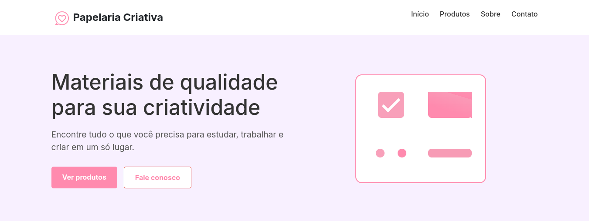

# ✨ Papelaria Criativa

Repositório do site da **Papelaria Criativa**, desenvolvido como parte da trilha de desenvolvimento da **Residência TIC Capacita - C Jovem**.

<p align="center">
  
</p>

---

## 📌 Sobre o Projeto

O site da Papelaria Criativa tem como objetivo oferecer uma interface simples e atrativa para apresentar a loja e seus produtos. As principais funcionalidades incluem:

- 🛍️ Página "Sobre a Loja" com informações institucionais  
- 📦 Exibição de produtos disponíveis  
- 📍 Informações de localização e contato  
- 💡 Elementos interativos que proporcionam uma experiência mais dinâmica para o usuário  

---

## 🚀 Tecnologias Utilizadas

- HTML5  
- CSS3  

---

## ⚙️ Como Executar o Projeto

1. Clone este repositório:
   ```bash
   git clone git@github.com:carlosrodrigues07/papelaria-web.git
   ```

2. Navegue até a pasta do projeto:
   ```bash
   cd papelaria-web
   ```

3. Abra o arquivo `index.html` no seu navegador preferido.

---

## 🤝 Colaboradores

<table>
  <tr>
    <td align="center">
      <a href="https://github.com/carlosrodrigues07">
        <br/>
        <strong>Carlos Henrique</strong>
      </a>
    </td>
    <td align="center">
      <a href="https://github.com/wesleycosta061203">
        <br/>
        <strong>Wesley Costa</strong>
      </a>
    </td>
    <td align="center">
      <a href="https://github.com/thyagooof">
        <br/>
        <strong>Thyago Oliveira</strong>
      </a>
    </td>
    <td align="center">
      <a href="https://github.com/paulomoura24">
        <br/>
        <strong>Paulo Moura</strong>
      </a>
    </td>
    <td align="center">
      <a href="https://github.com/DevLuanaAlves">
        <br/>
        <strong>Luana Alves</strong>
      </a>
    </td>
  </tr>
</table>

---

## 📄 Licença

Este projeto é de uso educacional e não possui uma licença específica definida.  
Sinta-se à vontade para explorar e aprender com o código!